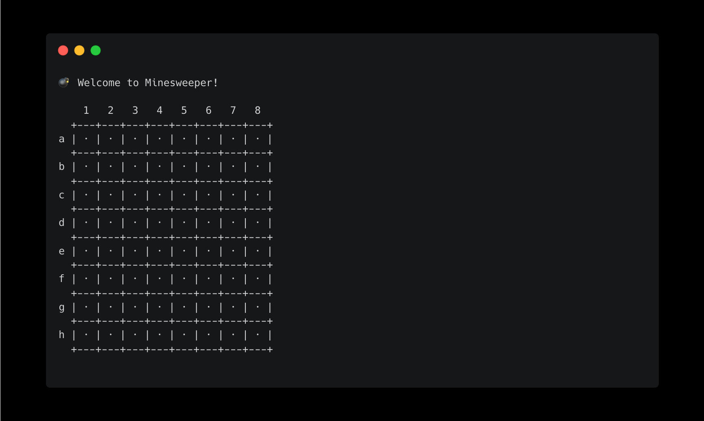
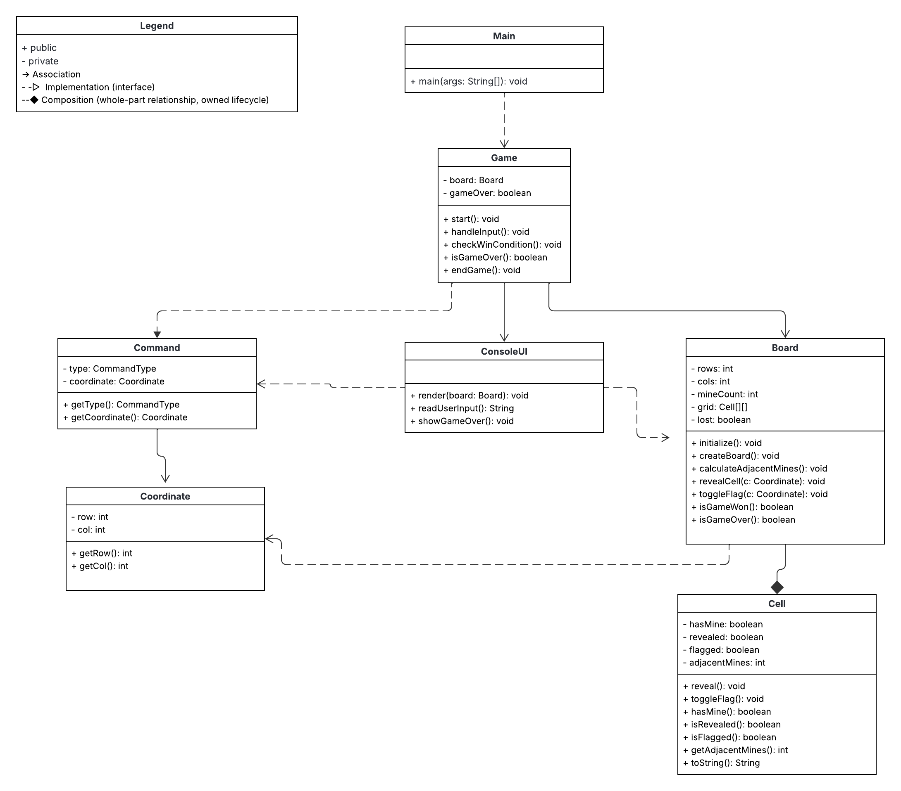

# 💣 Minesweeper (Text-Based Java Game)



This project is a text-based Minesweeper game developed in Java as a group assignment.  
The player interacts through the terminal, revealing cells and trying to avoid hidden mines.  
The project follows object-oriented design principles and is structured according to a UML class diagram.

## Table of Contents
- [Project Goals](#-project-goals)
- [Group Information](#-group-information)
- [Design](#-design)
  - [UML Overview and Project Planning](#-uml-overview)
  - [Trello](#-trello)
  - [Project Structure](#-project-structure)
- [Existing Features](#-existing-features)
    - [Game](#-game)
    - [Board](#-board)
    - [Cell](#-cell)
    - [Command](#-command)
    - [Coordinate](#-coordinate)
    - [ConsoleUI](#-consoleui)
- [Future Features](#-future-features)
- [How to Run](#-how-to-run)
- [Credits](#-credits)

[Back to top](#table-of-contents)

## 🎯 Project Goals

- Develop a fully functional, text-based version of Minesweeper using Java.
- Apply object-oriented programming principles such as encapsulation and composition.
- Work collaboratively using a shared UML diagram as the foundation for class design.
- Create a clean and intuitive console experience.
- Practice modular coding and teamwork through Trello-based task management.

[Back to top](#table-of-contents)

## 👥 Group Information

**Group name:** CodeQueens — *mastering logic, one line at a time.*  
**Project type:** Group assignment – Text-Based Java Game (Minesweeper)

**Members:**
- [Linnéa](https://github.com/Linnea87) 
- [Amanda](https://github.com/Amandamandaanda)
- [Aurelie](https://github.com/aurevau)
- [Ruth](https://github.com/RuthPaulsson)

[Back to top](#table-of-contents)

## 🎨 Design

### 🧭 UML Overview

Our UML diagram illustrates the relationship between classes such as `Game`, `Board`, `Cell`, `Command`, `Coordinate`, and `ConsoleUI`.



### Trello

At the beginning of the project, we planned to organize our work using user stories to describe different game features and tasks.  
However, we were limited by the free version of Trello, which made it difficult to use checklists and detailed task tracking.

Because of this, we decided to base our Trello board on the classes from our UML diagram instead.  
Each class (`Game`, `Board`, `Cell`, `Command`, `Coordinate`, `ConsoleUI`) had its own Trello card.

On each card, we divided the work between group members (A–D), where each person implemented specific methods or parts of the class.

This approach allowed us to:
- Follow our UML structure directly during development.
- Divide the work fairly between all members.
- Collaborate efficiently without overwriting each other’s code.

🔗 [View our Trello board](https://trello.com/b/svIWGBWV/minroj)

[Back to top](#table-of-contents)

### 🧩 Project Structure

The project is divided into packages to separate logic, data, and user interaction clearly:

```
app/       → Game flow and main control (Game, Main)
model/     → Board and cell logic (Board, Cell)
core/      → Core types and commands (Command, Coordinate)
ui/        → Console interface (ConsoleUI)
```

This structure follows an MVC-like architecture:

- **Model** handles data and game rules.
- **View (UI)** manages user interaction.
- **Controller (Game)** coordinates between them.

[Back to top](#table-of-contents)

## 🕹️ Existing Features

Our text-based Minesweeper game recreates the classic gameplay experience directly in the console.  
The program is structured for clarity, maintainability, and modular design, following an MVC-like approach.

### 🎮 Game (app)
- Controls the overall **game flow** — from start to finish.
- Manages user input, win/loss detection, and the main game loop.
- Coordinates between the `Board`, `Command`, and `ConsoleUI` classes.

### 🧮 Board (model)
- Represents the **entire grid** where the game takes place.
- Handles creation of the board, mine placement, and cell interactions.
- Counts adjacent mines and determines whether a move results in a win or loss.

### ⬜ Cell (model)
- Represents a **single cell** on the board.
- Stores its state (hidden, revealed, flagged, or mined).
- Returns a visual symbol for display in the console.

### ⚙️ Command (core)
- Represents the **player’s chosen action**, such as revealing or flagging a cell.
- Includes a `Coordinate` to specify the target cell.
- Supports multiple command types through `CommandType`.

### 📍 Coordinate (core)
- Defines a **specific position** on the board (row and column).
- Converts text-based input (like `A3`) into valid numeric coordinates.
- Used by both `Command` and `Board` to locate cells.

### 🖥️ ConsoleUI (ui)
- Handles all **user interaction** via the terminal.
- Displays the board state, reads and validates input, and shows feedback messages.
- Provides clear visual cues for game events (win, loss, or invalid input).

[Back to top](#table-of-contents)

## 🧪 Future Features

- Difficulty levels (Easy, Medium, Hard)
- Timer and score tracking
- Separate messages for different types of invalid input
- Press **Enter** to display the board (instead of showing it immediately with the welcome message and instructions)

[Back to top](#table-of-contents)

## 🚀 How to Run

Clone or download the project, then open a terminal in the project folder.

```
javac app/Main.java
java app.Main
```

Follow the instructions in the terminal to play the game.

[Back to top](#table-of-contents)

## ✨ Credits
- Occasional debugging, code review, and documentation support were assisted by AI tools.
- [Lucidchart](https://lucid.app/) was used to design the UML class diagram.
- [Trello](https://trello.com/) was used to organize the project workflow and class-based tasks.
- [Carbon](https://carbon.now.sh/) was used to create the terminal mockup image included in this README.

💻 Happy coding!

*CodeQueens*